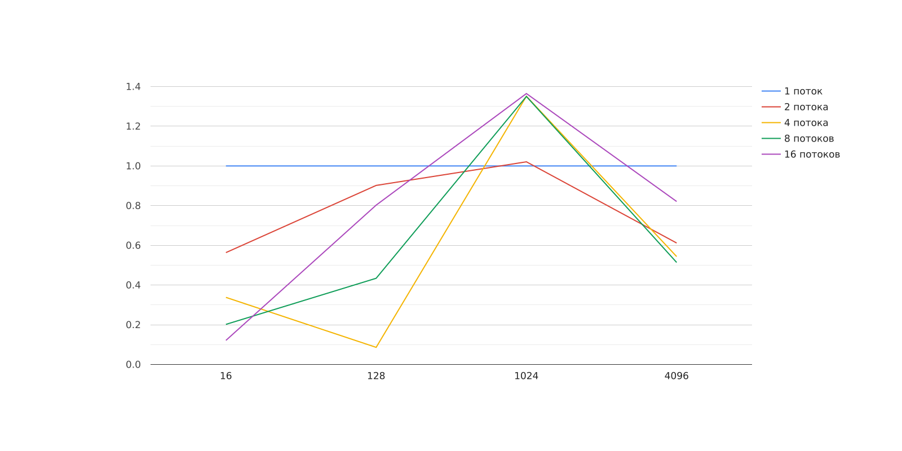

# Лабораторная работа №2, задание 1

Используемая архитектура для вычисления времени работы алгоритма:
**AMD Ryzen 5 3500U with Radeon Vega Mobile Gfx**

Для каждой комбинации входных данных выполнялось 5 измерений, затем полученные значения усреднялись.

## Алгоритм разбиения по строкам:

Алгоритм умножения матрицы на вектор по строкам заключается в умножении каждой строки матрицы на соответствующий элемент вектора и последующем сложении полученных произведений для формирования результирующего вектора.
Умножение происходит в функции matrixVectorMultiplyByRows, в ней каждый процесс получает свой диапазон строк для вычисления, каждый процесс считает частичный результат умножения для своих строк матрицы.
Затем используется функция MPI_Reduce для суммирования частичных результатов от каждого процесса в общий результат.

### Данные выполнения умножения матрицы на вектор с помощью разбиения по строкам 

| Размер | Процессы | Время выполнения | Ускорение | Эффективность |
|--------|----------|------------------|-----------|----------------|
|   16   |     1    |   0.0000423 s    | 1         | 1              |
|   16   |     2    |   0.0012074 s    | 0.035061  | 0.0175305      |
|   16   |     4    |   0.0028542 s    | 0.014854  | 0.0037135      |
|   16   |     8    |   0.0026917 s    | 0.015736  | 0.001967       |
|   16   |    16    |   0.0045564 s    | 0.009287  | 0.000580437    |
|  128   |     1    |   0.0009844 s    | 1         | 1              |
|  128   |     2    |   0.0011808 s    | 0.834503  | 0.417251       |
|  128   |     4    |   0.0034987 s    | 0.281251  | 0.0703128      |
|  128   |     8    |   0.0058108 s    | 0.169388  | 0.0211735      |
|  128   |    16    |   0.0046154 s    | 0.21366   | 0.0133544      |
| 1024   |     1    |   0.0688121 s    | 1         | 1              |
| 1024   |     2    |   0.0336859 s    | 2.04167   | 1.02083        |
| 1024   |     4    |   0.0240192 s    | 2.86404   | 0.716011       |
| 1024   |     8    |   0.0876516 s    | 0.785644  | 0.0982055      |
| 1024   |    16    |   0.0388176 s    | 1.77286   | 0.110804       |
| 4096   |     1    |   0.693917 s     | 1         | 1              |
| 4096   |     2    |   0.62951 s      | 1.10238   | 0.551191       |
| 4096   |     4    |   0.570063 s     | 1.21689   | 0.304223       |
| 4096   |     8    |   0.284884 s     | 2.43744   | 0.30468        |
| 4096   |    16    |   0.175407 s     | 3.96045   | 0.247528       |

*Графики зависимости времени от входных данных:*

*Графики зависимости ускорения от входных данных:*

*Графики зависимости эффективности от входных данных:*

## Алгоритм разбиения по столбцам:
Алгоритм умножения матрицы на вектор по столбцам заключается в умножении каждого столбца матрицы на соответствующий элемент вектора и последующем сложении полученных произведений для формирования результирующего вектора.
Умножение происходит в функции matrixVectorMultiplyByColumns, эта функция распределяет столбцы матрицы и элементы вектора между процессами, каждый процесс считает результат для своего диапазона, затем промежуточные результаты суммируются в итоговую матрицу.

### Данные выполнения умножения матрицы на вектор с помощью разбиения по столбцам
| Размер | Процессы | Время выполнения | Ускорение | Эффективность |
|--------|----------|------------------|-----------|----------------|
|   16   |     1    |   0.0000367 s    | 1         | 1              |
|   16   |     2    |   0.0000325 s    | 1.12708   | 0.563538       |
|   16   |     4    |   0.0000271 s    | 1.35166   | 0.337916       |
|   16   |     8    |   0.0000227 s    | 1.6158    | 0.201975       |
|   16   |    16    |   0.0000189 s    | 1.94074   | 0.121296       |
|  128   |     1    |   0.0012061 s    | 1         | 1              |
|  128   |     2    |   0.000831 s     | 1.45276   | 0.726382       |
|  128   |     4    |   0.0034987 s    | 0.34487   | 0.086218       |
|  128   |     8    |   0.0003474 s    | 3.47367   | 0.434209       |
|  128   |    16    |   0.000089 s     | 12.8427   | 0.802669       |
| 1024   |     1    |   0.114943 s     | 1         | 1              |
| 1024   |     2    |   0.0636565 s    | 1.80392   | 0.90196        |
| 1024   |     4    |   0.0212603 s    | 5.40388   | 1.35097        |
| 1024   |     8    |   0.0106344 s    | 10.8007   | 1.35009        |
| 1024   |    16    |   0.0052614 s    | 21.8342   | 1.36464        |
| 4096   |     1    |   1.89262 s      | 1         | 1              |
| 4096   |     2    |   1.54656 s      | 1.22352   | 0.611758       |
| 4096   |     4    |   0.870925 s     | 2.17451   | 0.543628       |
| 4096   |     8    |   0.460279 s     | 4.11095   | 0.513869       |
| 4096   |    16    |   0.144078 s     | 13.1351   | 0.820944       |

*Графики зависимости времени от входных данных:*

*Графики зависимости ускорения от входных данных:*

*Графики зависимости эффективности от входных данных:*

## Алгоритм разбиения по блокам:
Умножение матрицы на вектор по блокам - это метод, который разбивает исходную матрицу и вектор на подматрицы и подвекторы соответственно, умножает их блоками и затем объединяет результаты для формирования конечного вектора-результата.
Умножение происходит в функции matrixVectorMultiply, каждый процесс берет свои блоки матрицы и вектора и вычисляет частичные результаты умножения для этих блоков, затем частичные результаты объединяются в один с помощью функции MPI_Gather.

### Данные выполнения умножения матрицы на вектор с помощью разбиения по блокам

| Размер | Процессы | Время выполнения | Ускорение | Эффективность |
|--------|----------|------------------|-----------|----------------|
|   16   |     1    |   0.0000529      | 1         | 1              |
|   16   |     2    |   0.0009744      | 0.054385  | 0.0271925      |
|   16   |     4    |   0.0015222      | 0.034789  | 0.00869725     |
|   16   |     8    |   0.0028101      | 0.018855  | 0.00235688     |
|   16   |    16    |   0.0078175      | 0.006765  | 0.000422812    |
|  128   |     1    |   0.0006652      | 1         | 1              |
|  128   |     2    |   0.000831       | 0.800735  | 0.400368       |
|  128   |     4    |   0.0032737      | 0.203036  | 0.050759       |
|  128   |     8    |   0.0070914      | 0.093748  | 0.0117185      |
|  128   |    16    |   0.003421       | 0.194442  | 0.0121526      |
| 1024   |     1    |   0.0459508      | 1         | 1              |
| 1024   |     2    |   0.0636565      | 0.720976  | 0.360488       |
| 1024   |     4    |   0.036021       | 1.27332   | 0.31833        |
| 1024   |     8    |   0.0684249      | 0.671478  | 0.0839348      |
| 1024   |    16    |   0.0070965      | 6.47543   | 0.404714       |
| 4096   |     1    |   0.668553       | 1         | 1              |
| 4096   |     2    |   0.435883       | 1.5336    | 0.7668         |
| 4096   |     4    |   0.359802       | 1.85888   | 0.46472        |
| 4096   |     8    |   0.156862       | 4.26031   | 0.532539       |
| 4096   |    16    |   0.0786548      | 8.49795   | 0.531247       |

*Графики зависимости времени от входных данных:*

*Графики зависимости ускорения от входных данных:*

*Графики зависимости эффективности от входных данных:*

